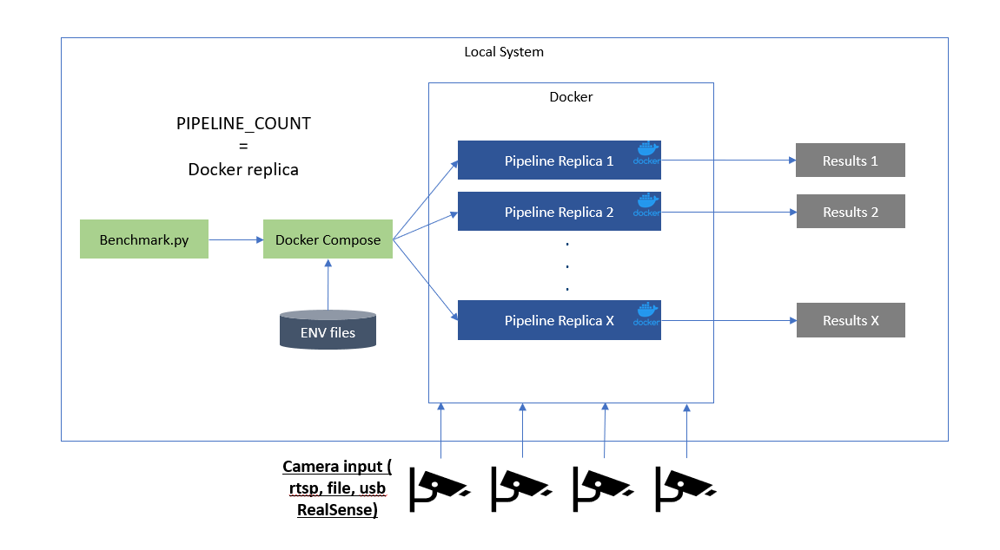

# Performance Evaluation Service

The provided Python-based script works with Docker Compose to get pipeline performance metrics like video processing in frames-per-second (FPS), memory usage, power consumption, and so on.

## Overview

Tools to measure system performance while running a workload.

## How it works

run `make build`
run `make performance tools`

## Architecture Diagram

Specific number of pipelines with single container

## Documentation

- [Open source code for setup, install, and execution of software, with complete developer documentation](https://intel-retail.github.io/documentation/performance-tools/benchmark.html)

## Join the community 
